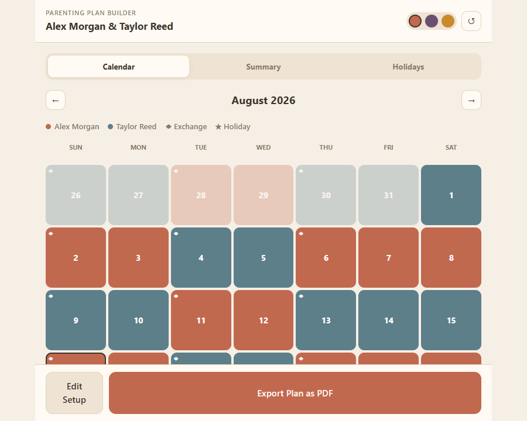

# Parenting Plan Builder

A web app that helps parents (with attorney support) build a custody schedule and instantly see what it means in practice — a calendar, and the underlying numbers a court cares about, like overnight counts, weekend splits, and how often the kids change households.



## What it does

You walk through three steps:

1. **Parents & kids** — enter each parent's name and pick a color for them (used everywhere else in the app so the schedule is easy to read at a glance), then add the kids.
2. **Schedule** — pick a residential schedule from five common custody rotations (like "2-2-3" or "Week On / Week Off"), or answer a short guided quiz if you're not sure which one fits. Set the start date and which parent has the kids first.
3. **Calendar, Summary & Holidays** — three connected views:
   - **Calendar**: a month-by-month view, color-coded by parent, with markers for exchange days and holidays. Tap any day to manually reassign it (e.g. for a one-off swap) without disturbing the rest of the schedule.
   - **Summary**: live math for any calendar year — total overnights per parent, overnight percentage, weekend nights, holiday nights, number of exchanges, and the longest/average stretch each parent gets in a row.
   - **Holidays**: the major U.S. holidays (Thanksgiving, winter break, Mother's/Father's Day, etc.), which alternate between parents by year by default, with the ability to override any specific holiday in any specific year.

Everything recalculates live as you make changes — there's no separate "save" step.

The app also has three color themes (Clay, Dusk, Harvest) you can switch between from the top bar, and it remembers your plan in the browser (via local storage) if you close the tab and come back.

**Not yet built:** the "Export Plan as PDF" button is currently a placeholder — it shows a "coming soon" message instead of generating a real file.

## How to run it

**Prerequisites:** [Node.js](https://nodejs.org/) (v20 or newer recommended). npm comes bundled with it.

```bash
# 1. Clone the repo
git clone <this-repo-url>
cd pp-website

# 2. Install dependencies
npm install

# 3. Start the app
npm run dev
```

This starts a local dev server and prints a URL (usually `http://localhost:5173`) — open that in your browser.

Other useful commands:

```bash
npm run build   # type-checks and builds a production bundle into dist/
npm run lint    # runs the linter
```

## Tech stack

- [React](https://react.dev/) + [TypeScript](https://www.typescriptlang.org/), built with [Vite](https://vite.dev/)
- [Tailwind CSS](https://tailwindcss.com/) v4
- No backend — all state lives in the browser (React state + `localStorage`). Nothing is sent to a server.

## Project structure

```
src/
  lib/         schedule math and data (dates, holiday rules, custody-rotation templates) — plain TypeScript, no React
  state/       app state (React Context) and localStorage persistence
  screens/     the three main screens (intake, schedule builder, tools)
  components/  reusable UI pieces (calendar grid, day modal, summary cards, holiday list, etc.)
legacy-static-prototype/
  an earlier, dependency-free HTML/CSS/JS version of the same app, kept for reference
```
